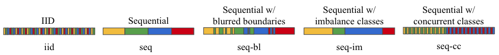

# Online Self-Supervised Contrastive Lifelong Learning without Prior Knowledge

This repo contains the implementation for paper:

Xiaofan Yu, Yunhui Guo, Sicun Gao, Tajana Rosing. "SCALE: Online Self-Supervised Contrastive Lifelong Learning without Prior Knowledge" in CLVision 2023.

[arXiv link](https://arxiv.org/abs/2208.11266)

## File Structure

* `OnlineContrast` holds the implementation of our method SCALE, SimCLR and CaSSLe. The code is implemented based on [SupContrast](https://github.com/HobbitLong/SupContrast).
* `UCL` holds the implementation of LUMP, PNN, SI, DER adapted from the original repo [UCL](https://github.com/divyam3897/UCL).
* `stam` holds the implementation of STAM adapted from the original repo [stam](https://github.com/CameronTaylorFL/stam).

## Prerequisites

In each folder, set up the environment with `pip3 install -r requirements.txt`. We test `OnlineContrast` and `UCL` with Python3.8, while `STAM` is tested with Python3.6. Our machine uses CUDA 11.7 and a NVIDIA RTX 3080 Ti GPU.

### Dataset Preparation

We mainly focus on image classification while the methodology can be applied to more general scenarios. In this repo, we test with MNIST (10 classes), CIFAR-10 (classes), CIFAR-100 (20 coarse classes) and SubImageNet (10 classes). 

For all methods in `OnlineContrast` and `UCL` folders, the shared root dataset directory is `datasets`. 

* The download and configuration of MNIST, CIFAR-10, CIFAR-100 should be completed automatically by the code. 
* For SubImageNet, sometimes the download cannot proceed normaly. If that is the case, please download [our subset](https://drive.google.com/file/d/13Ew7XGpMtKg6ODVXetogpUEtDvgTu8TM/view?usp=sharing) of 10 classes adapted from the original [TinyImageNet](https://drive.google.com/file/d/1Sy3ScMBr0F4se8VZ6TAwDYF-nNGAAdxj/view). Unzip the file into `OnlineContrast/datasets` and you should obtain a folder as `OnlineContrast/datasets/TINYIMG`.

For STAM, as written in the original [repo](https://github.com/CameronTaylorFL/stam), you need to download datasets from [here](https://drive.google.com/file/d/1CLohFBp-uKiP35O_NtGvl9nPxnqlzijz/view?usp=sharing) and unzip into the `./stam` directory as `./stam/datasets`.

## Getting Started

We list the commands to fire our method and each baseline in the following lines.

### OnlineContrast

We adapt the code from the [SupContrast](https://github.com/HobbitLong/SupContrast) repo. To run our method SCALE:

```bash
cd OnlineContrast/scripts
bash ./run-scale.sh scale <mnist/cifar10/cifar100/tinyimagenet> <iid/seq/seq-bl/seq-cc/seq-im> <trial#>
```

* We test with five types of data streams as discussed in the paper: (1) **iid**, (2) sequential classes (**seq**), (3) sequential classes with blurred boundaries (**seq-bl**), (4) sequential classes with imbalance lengths (**seq-**
  **im**), and (5) sequential classes with concurrent classes (**seq-cc**). More details about data stream configuration are explained later.
* For all implementations, the last argument of `trial#` (e.g., `0,1,2`) determines the random seed configuration. Hence using the same `trial#` produces the same random selection.

You can run `run-<simclr/supcon/co2l/cassle>.sh` to run the corresponding baseline with similar argument format.

### UCL

We replace the original data loader with our own loader. For evaluation, we also adapt the original code with our own clustering and kNN classifier on the learned embeddings.

We run LUMP (`mixup` in argument), PNN, SI and DER as baselines to compare:

```bash
cd UCL
bash ./run-baseline.sh <mixup/pnn/si/der> supcon <mnist/cifar10/cifar100/tinyimagenet> <iid/seq/seq-bl/seq-cc/seq-im> <trial#>
```

The data streams and model configuration for LUMP, PNN, SI, DER are in `UCL/set_util.py`. In our setup, we fire the experiments with `UCL/test_all.sh`.

### STAM

We replace the original data loader with our own loader. For evaluation, we also adapt the original code with our own clustering and kNN classifier on the learned embeddings.

To run the code:

```bash
cd stam
bash ./stam_IJCAI.sh <mnist/cifar10/cifar100> <iid/seq/seq-bl/seq-cc/seq-im>
```

The data streams configurations for STAM are in `stam/core/dataset.py`. In our setup, we directly fire all experiments with `stam/run_all.sh`.

## Data Stream Configuration

The single-pass and non-iid data streams are the key motivation of the paper. As discussed in the paper, we consider five type of single-pass streams:



* Take SCALE for an example, iid input stream is configured by
  ```bash
  # In the ./OnlineContrast directory
  python main_supcon.py --training_data_type iid
  ```

* The sequential class-incremental data stream is configured by
  ```bash
  # In the ./OnlineContrast directory
  python main_supcon.py --training_data_type sequential
  ```

* The sequential data stream with blurred boundary is configured by
  ```bash
  # In the ./OnlineContrast directory
  python main_supcon.py --training_data_type sequential --blend_ratio 0.5
  ```

  The loader blends the last 0.25 portion of samples from the previous class with the first 0.25 portion of the next class, which leads to a total blend ratio of 0.5 as the specified `blend_ratio` argument. The blending probability is linearly increased as approaching the boundary.

* The sequential data stream with imbalanced classes is configured by
  ```bash
  # In the ./OnlineContrast directory
  python main_supcon.py --training_data_type sequential --train_samples_per_cls 250 500 500 500 250 500 500 500 500 500
  ```

  If the argument of `train_samples_per_cls` holds a single integer, then the samples of all classes are set to this integer. If `train_samples_per_cls` holds a list of integers, then the samples of each sequential class is set to match the list.

* The sequential data stream with concurrent classes is configured by
  ```bash
  # In the ./OnlineContrast directory
  python main_supcon.py --training_data_type sequential --n_concurrent_classes 2
  ```

  We consider the case that two classes are reveled concurrently.

More implementation details can be found in `./set_util.py` in the `SeqSampler` class.

## Citation

If you found the codebase useful, please consider citing

```
@article{yu2022scale,
  title={SCALE: Online Self-Supervised Lifelong Learning without Prior Knowledge},
  author={Yu, Xiaofan and Guo, Yunhui and Gao, Sicun and Rosing, Tajana},
  journal={arXiv preprint arXiv:2208.11266},
  year={2022}
}
```

## License

MIT

If you have any questions, please feel free to contact [x1yu@ucsd.edu](mailto:x1yu@ucsd.edu).
